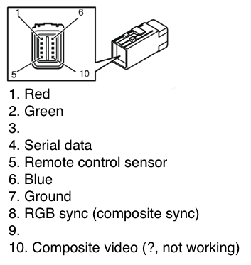

## Controlling Volvo V50 '07 RTI screen with Arduino

Part of [retrofitting of Android Auto to Volvo RTI project](https://github.com/laurynas/volvo_crankshaft).

## Power connection

I used Arduino 12V power adapter to power the screen.

## Screen connection

## Screen control signal

Screen is controlled by sending serial signal to screen pin 4. Baud rate 2400, delay between bytes 100ms (works with other close values too).

[Code example](arduino/rti_serial/rti_serial.ino)

[Video example](https://www.youtube.com/watch?v=QqmE6McCTZU)

## VGA signal

VGA signal is generated from Arduino UNO using customized [VGAX library](arduino/VGAXS/). I have changed VGAX HSYNC interval to 64μs, adjusted positioning, pixel timing. 

Display uses VGA Composite Sync signal, so HSYNC & VSYNC signals must be combined into one. I tried just connecting both wires to video sync pin and it worked! So, no need for [signal combining logic](http://www.epanorama.net/circuits/vga2rgbs.html).

Arduino UNO [VGA example](arduino/vga_pirate/vga_pirate.ino).

## Credits

While digging for information I found the most useful info here:

- Reinis Veps [CarPC project](http://wot.lv/category/rpi-carpc.html)
- Niclas Lardh [discussion](http://www.svxc.se/phpBB2/viewtopic.php?t=22034)
- maniacus [CarPC project](https://www.drive2.ru/l/6048661/)
- Nick Gammon & Sandro Maffiodo [VGAX library for Arduino UNO](https://github.com/smaffer/vgax)
